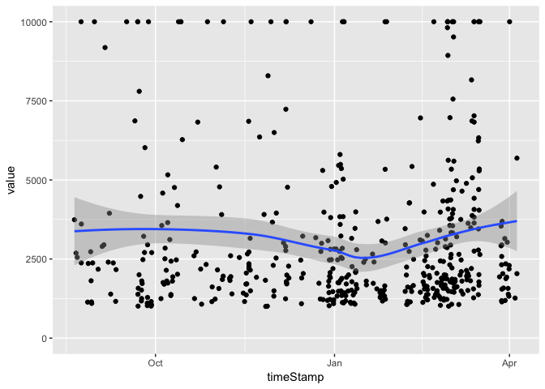

<!-- README.md is generated from README.Rmd. Please edit that file -->
etherscanr
==========

The package offers an easy way to use the [etherscan.io API](https://etherscan.io/apis) to query information about the Ethereum network. The package uses `Rmpfr` for number represenstation where possible.

Currently **work in progress**. This is an unofficial package. As always use it at your own risk.

API
---

-   Accounts
    -   `etherscan_transactions` get all transaction of an account
    -   `etherscan_internal_transactions` get all internal transactions
    -   `etherscan_balance` retrieve account balances
-   Stats
    -   `etherscan_ethsupply` returns the total Ether supply in Wei
    -   `etherscan_lastprice` returns the last price in USD
-   Helpers
    -   `to_ether` converts wei to ether using the Multiple Precision Floating-Point Reliable (MPFR) library.

Example
-------

For example let us examine all the transactions of account [0x6F46CF5569AEfA1acC1009290c8E043747172d89](https://etherscan.io/address/0x6F46CF5569AEfA1acC1009290c8E043747172d89):

``` r
library(etherscanr)
library(dplyr)
library(ggplot2)
etherscan_transactions("0x6F46CF5569AEfA1acC1009290c8E043747172d89") %>% 
  mutate(value = to_ether(value, from = "wei")) %>% 
  filter(value > 0) %>% 
  ggplot(aes(x = timeStamp, y = value)) + 
  geom_point() +
  stat_smooth() + # we smooth it just because it looks nice ;)
  theme(legend.position = "bottom") + 
  expand_limits(y = 0)
```



Contributed
-----------

This is an open project. Anyone who would like to contribute (features, bug fixes, documentation) is very welcome to do so.

Please note that this project is released with a [Contributor Code of Conduct](CONDUCT.md). By participating in this project you agree to abide by its terms.
